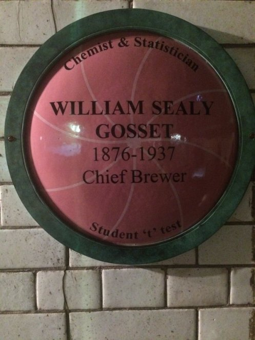

```{r setup, include=FALSE}
knitr::opts_chunk$set(echo = FALSE)
```

## Topic 1: Student's t test

### Let's learn about t testing

Let's start with a flipbook slide show.
When the title slide appears, you can step through each line of the code to see what it does. The arrows will let you move forward and backward in the code.

You can use the arrow keys to go through it one step at a time (forward or backward, depending on which arrow key you use), to see what each line of code actually does.

Give it a try below. See if you can figure out what each line of code is doing.

### Flipbook Time!

<!---FLIPBOOK EX 1--> 

<iframe style="margin:0 auto; border: solid black;" 
id="myIframe8" 
width = "880" height = "495" src="https://higgi13425.github.io/learnr_iframe/ttest_flipbook.html#1" 
scrolling="no"></iframe> 

<!-------------> 

This is ttesting in action.

### Exercise 

Now it is your turn to try doing a t test.

Edit the R code in the chunk below to add do a t test on the continuous variable miles per gallon (mpg) by transmission group (am, automatic or manual).
Note that you have to **replace** the placeholders cont_var (for continuous variable) and group_var (for grouping variable) in this code chunk.

### Learnr Exercise Time!

Click the 'Start Over' button to refresh the exercise window.
Then edit the code yourself.

<!---LEARNR EX 1--> 

<iframe style="margin:0 auto; min-width: 100%;" id="myIframe7" class="interactive"  src="https://pdrhiggins.shinyapps.io/learnr_app1/" scrolling="no" frameborder="no"></iframe> 

<!-------------> 

### The t-distribution

Thus you can see the power of the mighty t test. William Sealy Gosset created it, and he is memorialized with a plaque at the Old Guinness Storehouse, where beer tours now are the primary business at this historical site. The plaque is not on the official tour, but can be found if you slip away from the tour and duck under some chains. Fortunately, most of the other tourists (and perhaps the tour guides) are usually well into their pints. For inexplicable reasons, the plaque with Gossett's name resembles a basketball with a green ring around it.



### And now an animation

```{r}
library(knitr)
knitr::include_url("https://twitter.com/i/status/1176838581723238401" )
```


<script>
  iFrameResize({}, ".interactive");
</script>
